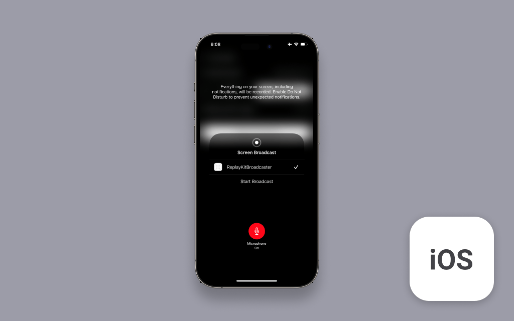

# Amazon IVS Real-time Screenshare for iOS Demo

A demo SwiftUI iPhone application intended as an educational tool to demonstrate how you can share you device screen to an Amazon IVS Stage.

>[!CAUTION]
> **Use at Your Own Risk: This is a starting code sample designed to help developers get started with basic functionality. It is not production-ready and will require additional development work to be suitable for production use. This sample is not intended to bridge that gap - significant optimization and memory management improvements will be needed for any production implementation.**
>It is **not** intended for production use. Its primary goal is to help you understand the concepts and capabilities of Amazon IVS. By using this solution, you understand and accept its risks and limitations.
>
> While functional, users should be aware of the following considerations:
>
> - **Device Compatibility Warnings**
>   - iPad Users: This implementation may experience stability issues on certain iPad devices, particularly older models with limited processing power or memory constraints
>   - Memory Limitations: The application may approach or exceed device memory limits during use, potentially resulting in crashes or unexpected behavior
>   - Performance Variability: Performance may vary significantly across different device types, operating system versions, and hardware configurations
> - **Recommendations**
>   - Test your implementation thoroughly on your target devices before rolling out screenshare in production
>   - Monitor memory usage during development and testing
>   - Newer devices with enhanced processing capabilities typically provide better performance and stability

This sample code is intended to demonstrate Amazon IVS capabilities and should be adapted and optimized for your specific production requirements. Use this code as a foundation for learning and initial development only.

## Prerequisites

A valid [Amazon IVS stage token](https://docs.aws.amazon.com/ivs/latest/RealTimeUserGuide/getting-started.html).

## Setup

1. Clone the repository to your local machine.
2. Install the SDK dependency using CocoaPods: `pod install`
3. Open `ScreenSharing.xcworkspace`.
4. Since iPhone simulators don't support ReplayKit, you must build and run the app on a physical device and do some preparation:
   1. Have an active Apple Developer account in order to build to physical devices.
   2. Modify the Bundle Identifier for the `ScreenSharing` target.
   3. Make sure the Bundle Indentifier for the `ReplayKitBroadcaster` target follows `your_screensharing_target_bundle_id.ReplayKitBroadcaster` pattern.
   4. Choose a Team for the target.
   5. Make sure both targets use the same App Group (if the group does not exist, create one and add to both targets).
   6. In `Constants.swift` file set `appGroupName` to the name of App Group used in previous step.
5. You can now build and run the project on a device.

## Application usage

Upon launching the application, you will be asked to provide an IVS Stage token to proceed. You must create an IVS stage to create a stage token. Take the following steps:

1. Create an IVS Stage by taking the steps described in the documentation: [Create a Stage](https://docs.aws.amazon.com/ivs/latest/RealTimeUserGuide/getting-started-create-stage.html#getting-started-create-stage-console).
2. Create an stage token taking the steps described in the documentation: [Distribute Participant Tokens](https://docs.aws.amazon.com/ivs/latest/RealTimeUserGuide/getting-started-distribute-tokens.html).
3. Copy and paste the stage token into the input field in the application. You can follow the steps described in the following article to copy and paste between devices: [Copy and paste between devices](https://support.apple.com/guide/mac-help/copy-and-paste-between-devices-mchl70368996/mac).

**IMPORTANT NOTE:** Joining a stage and streaming in the app will create and consume AWS resources, which will cost money.

## Known Issues

- A list of known issues for the Amazon IVS Broadcast SDK is available on the following page: [Amazon IVS Real-Time SDK: iOS Guide](https://docs.aws.amazon.com/ivs/latest/RealTimeUserGuide/broadcast-ios-known-issues.html)

## More Documentation

- [Amazon IVS iOS Real-Time Broadcast SDK Guide](https://docs.aws.amazon.com/ivs/latest/RealTimeUserGuide/broadcast-ios.html)
- [Amazon IVS iOS Broadcast SDK Sample code](https://github.com/aws-samples/amazon-ivs-broadcast-ios-sample)
- [More code samples and demos](https://www.ivs.rocks/examples)

## Security

See [CONTRIBUTING](CONTRIBUTING.md#security-issue-notifications) for more information.

## License

This project is licensed under the MIT-0 License. See the LICENSE file.
